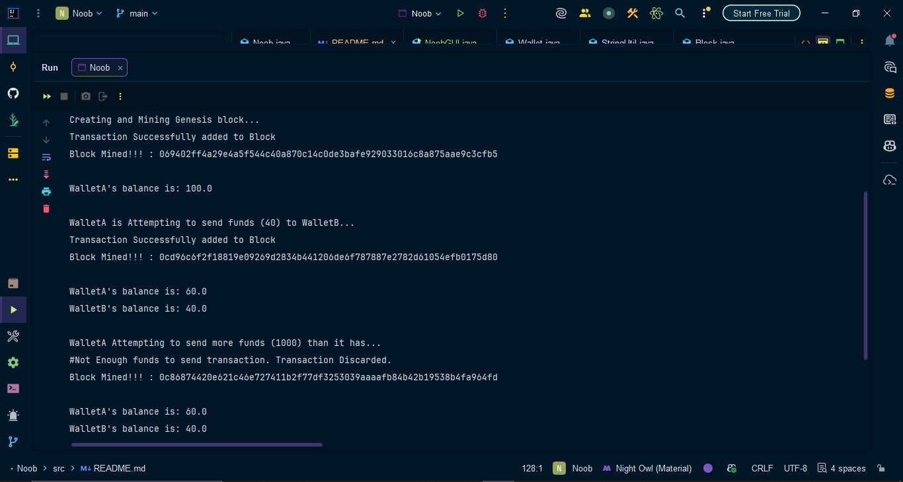

# ⛓️ Java-Blockchain (UTXO + Wallet + Mining)

<p align="center">
  
  
  
  
</p>

---

# 📌 Overview

A Java-based blockchain engine implementing UTXO transaction model, SHA-256 hashing, ECDSA signatures, and proof-of-work consensus.
Simulates real-world blockchain architecture with full transaction and chain validation.

- 🔐 Public/Private Key Wallets (ECDSA)
- ✍️ Digital Signatures
- 💰 UTXO-based Transaction Model
- ⛏️ Proof-of-Work Mining
- 🧱 Hash-linked Blocks
- 🔎 Full Blockchain Validation
- 📦 JSON Serialization using GSON

---

# 🧠 Core Concepts Implemented

## 🔐 Wallets & Cryptography
- ECDSA key pair generation using BouncyCastle
- Private key signing
- Public key verification
- Base64 key encoding

## 💰 UTXO Model
- Unspent Transaction Outputs (like Bitcoin)
- Dynamic balance calculation
- Double-spending prevention
- Input-output equality validation

## ⛏️ Mining (Proof of Work)
- Nonce-based hash solving
- Adjustable difficulty
- SHA-256 hashing
- Block integrity enforcement

## 🔎 Blockchain Validation
- Previous hash verification
- Block hash recalculation check
- Signature verification
- UTXO reference validation

---

# 🏗️ System Architecture

```
Wallet → Create Transaction → Sign → Add to Block → Mine → Add to Chain → Validate
```

### Layered Design

```
             ┌────────────────────┐
             │        GUI         │  
             └─────────▲──────────┘
                       │
             ┌─────────┴──────────┐
             │   Blockchain App   │
             └─────────▲──────────┘
                       │
      ┌────────────────┼────────────────┐
      │                │                │
 ┌────┴────┐     ┌─────┴─────┐     ┌────┴────┐
 │ Wallet  │     │ Transaction│     │  Block  │
 └────▲────┘     └─────▲─────┘     └────▲────┘
      │                │                │
      └────────────────┴────────────────┘
                       │
               ┌───────┴────────┐
               │   StringUtil   │
               │ (Crypto Layer) │
               └────────────────┘
```

---

# 📦 Project Structure

```
src/
    ├── README.md
    ├── Block.java
    ├── Wallet.java
    ├── NoobGUI.java
    ├── StringUtil.java
    ├── Transaction.java
    ├── TransactionInput.java
    └── TransactionOutput.java

```
---

# ⚙️ Requirements

- Java (JDK 8+)
- GSON (2.10.1)
- BouncyCastle (bcprov-jdk15on)

### 🚀 How to Run

1.  **Clone the Repository:**
    ```bash
    git clone https://github.com/Gaurav77Kumar/Basic-BlockChain
    ```
2.  **Import to IntelliJ:** Open the folder as a new project.
3.  **Add GSON:** * Go to `File` > `Project Structure` > `Libraries`.
    * Add the GSON library (Maven: `com.google.code.gson:gson:2.10.1`).
4.  **Execute:** Run the `Noob.java` file.

## 📸 Output

<p align="center">
  
</p>

---


