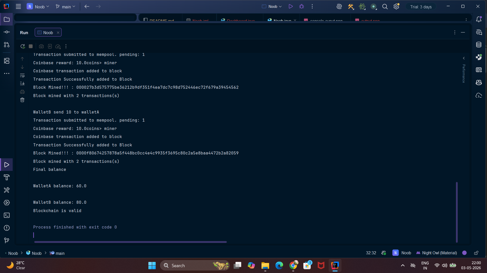
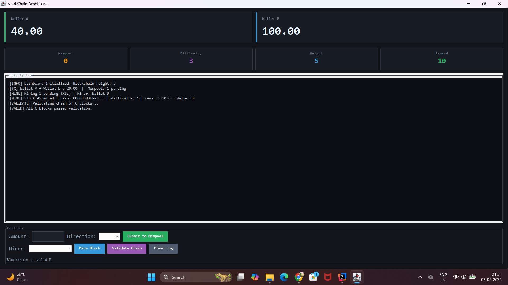

# ⛓️ Java-Blockchain — Bitcoin-Style UTXO Engine

<p align="center">
  
  
  
  
</p>

---

## 📌 Overview

A Bitcoin-style blockchain engine built from scratch in Java, implementing the **complete UTXO transaction lifecycle** — from coinbase issuance through fee-prioritized mempool staging, PoW mining, dynamic difficulty retargeting, and 2-node P2P consensus via Java Sockets. Every design decision mirrors a real Bitcoin mechanic.

| Feature | Status |
|---|---|
| UTXO Transaction Model | ✅ |
| ECDSA Wallets (BouncyCastle) | ✅ |
| Satoshi-Denomination Integers | ✅ |
| Proof-of-Work Mining | ✅ |
| Merkle Root Integrity | ✅ |
| Mempool with Fee Prioritization | ✅ |
| Coinbase Transaction + Mining Reward | ✅ |
| Transaction Fee Market | ✅ |
| Dynamic Difficulty Retargeting | ✅ |
| Per-Block Difficulty Snapshot | ✅ |
| Full Chain Validation | ✅ |
| 2-Node P2P Network (Java Sockets) | ✅ |
| 4-Layer Architecture (SRP) | ✅ |


---

## 🧠 Core Concepts

### 🔐 Wallets & Cryptography
- ECDSA key pair generation via BouncyCastle (`prime192v1` curve)
- Private key signing + public key verification per transaction
- Fee field included in signed data — prevents miner from tampering fee after signing
- Base64 key encoding via `StringUtil` crypto layer

### 💰 UTXO Model
- Full Bitcoin-style Unspent Transaction Output model
- Dynamic balance calculated by scanning UTXO map — no stored balance field
- Double-spend prevention: spent inputs removed from global UTXO set atomically
- Input-output equality enforced: `inputsValue = outputsValue + fee`
- Change outputs automatically returned to sender

### 🪙 Satoshi Denomination
- All coin values stored as `long` integers (satoshis) — never `float` or `double`
- 1 NoobCoin = 100,000,000 satoshis — identical to Bitcoin's unit model
- Eliminates floating-point precision errors (`0.1f + 0.2f = 0.30000001` in Java)
- Display conversion via `StringUtil.toCoins()` — satoshis → `x.xxxxxxxx` string

### 🏦 Mempool & Fee Market
- Transactions submitted via `sendFunds()` enter a global pending pool
- Miner sorts mempool **descending by fee** before packing a block
- Highest-fee transactions confirmed first — replicates Bitcoin's economic incentive
- Miner income = `miningReward + sum(all fees in block)`
- Mempool cleared atomically after successful mine

### ⛏️ Full Bitcoin Transaction Lifecycle
```
Coinbase TX (block reward + fees → miner)
    ↓
Wallet.sendFunds(recipient, value, fee) → Mempool
    ↓
MiningEngine.mineNextBlock() → sort by fee → pack block
    ↓
PoW solved → broadcast to peers → peers validate → append
    ↓
UTXO set updated → mempool cleared
```

### 🎯 Dynamic Difficulty Retargeting
- Difficulty stored **per block** at mine time — not read from global state
- Every `retargetInterval` blocks: compares actual vs target mine time
- Increases difficulty if blocks mined too fast, decreases if too slow
- Per-block snapshot fixes mid-chain retarget validation bug:
  blocks mined at difficulty 3 are validated against 3, not current difficulty 4

### 🌳 Merkle Root
- Merkle root computed from all transaction IDs in a block
- Stored in block header, included in `calculateHash()`
- Updated on every `addTransaction()` and `addCoinbase()` call
- Any tampered transaction changes the root → breaks block hash → detected by validator

### 🔎 Full Chain Validation (ChainValidator.java)
- Hash chain integrity: `previousHash` must match prior block's `hash`
- Per-block hash recalculation verified against stored hash
- Each block validated against **its own stored difficulty** — not global
- ECDSA signature verification on every non-coinbase transaction
- Conservation law: `inputsValue = outputsValue + fee` checked per TX
- UTXO reference validation: every input must reference an existing unspent output
- Coinbase skipped correctly (index 0, null sender)

### 🌐 2-Node P2P Network
- Each `Node` runs a `ServerSocket` listener on its own port (background thread)
- Mined blocks serialized via `ObjectOutputStream` and broadcast to all peers
- Receiving node validates before appending:
    1. `previousHash` matches local chain tip
    2. Hash satisfies stored difficulty
    3. Recalculated hash matches stored hash
    4. All transaction signatures valid
- `synchronized receiveBlock()` prevents race condition on concurrent broadcasts
- Retry logic (3 attempts) handles peer startup delay
- Shutdown hook calls `network.stopAll()` on JVM exit — no `Connection refused` errors

---

## 🏗️ Architecture

```
Wallet → sendFunds() → Mempool (fee-sorted) → MiningEngine.mineNextBlock()
    → Block (Coinbase + TXs) → PoW → broadcast via Node → peer validates
    → appended to local chain → ChainValidator.isChainValid()
```

### 4-Layer Design (Single Responsibility Principle)

```   

┌─────────────────────────────────────────────────────────────────┐
│  LAYER 1 · PRESENTATION                                         │
│                                                                 │
│   Dashboard.java                                                │
│   Swing GUI · live balances · mempool count · difficulty        │
│   block height · send/mine/validate controls · activity log     │
└───────────────────────────┬─────────────────────────────────────┘
                            │ reads BlockchainState · calls MiningEngine
                            │ calls ChainValidator · holds Node refs
┌───────────────────────────▼─────────────────────────────────────┐
│  LAYER 2 · ORCHESTRATION                                        │
│                                                                 │
│   Noob.java                                                     │
│   main() only · genesis bootstrap · simulation sequence         │
│   wires wallets → network → GUI · shutdown hook                 │
└──────┬────────────────┬──────────────────┬───────────────────── ┘
       │                │                  │
       ▼                ▼                  ▼
┌─────────────┐  ┌─────────────┐  ┌───────────────────────────────┐
│  LAYER 3 · SERVICES  (business logic — no shared state)         │
├─────────────┤  ├─────────────┤  ├───────────────────────────────┤
│BlockchainS..│  │MiningEngine │  │  ChainValidator               │
│             │  │             │  │                               │
│ blockchain[]│  │mineNextBlock│  │  isChainValid()               │
│ UTXOs map   │  │createCoinbase  │  tempUTXOs replay             │
│ mempool[]   │  │sortByFee    │  │  4-rule validation:           │
│ walletA/B   │  │adjustDiff.. │  │  hash · chain · PoW · UTXO   │
│ difficulty  │  │fee aggregat.│  │  read-only · no side effects  │
│ constants   │  │             │  │                               │
└──────┬──────┘  └──────┬──────┘  └───────────────────────────────┘
       │                │
       │       ┌────────┘
       │       │
┌──────▼───────▼────────────────────────────────────────────────────┐
│  LAYER 3b · NETWORK  (P2P — runs on background threads)           │
│                                                                    │
│   NetworkManager.java          Node.java                          │
│   createNode() · connectPeers  ServerSocket listener              │
│   seedAll() · startAll()       synchronized receiveBlock()        │
│   stopAll() · consensus check  broadcast() · retry logic          │
│   Facade over Node instances   localBlockchain · localUTXOs       │
└──────────────────────┬─────────────────────────────────────────────┘
                       │
┌──────────────────────▼─────────────────────────────────────────────┐
│  LAYER 4 · CORE DATA  (data classes + crypto utility)              │
│                                                                     │
│  Block              Transaction         TransactionInput           │
│  hash chain         UTXO lifecycle      UTXO pointer               │
│  nonce · PoW        sign · verify       two-phase resolve          │
│  merkleRoot         conservation law    double-spend guard         │
│  per-block diff     Merkle tree                                    │
│                                                                     │
│  TransactionOutput  Wallet              StringUtil                 │
│  UTXO data class    ECDSA keypair       SHA-256 · ECDSA            │
│  isMine() · ID      getBalance()        Base64 · toCoins()         │
│  satoshi value      sendFunds()         crypto utility belt        │
└─────────────────────────────────────────────────────────────────────┘
```

---

## 📦 Project Structure

```
src/
├── Noob.java               ← Orchestration: genesis, simulation, network wiring
├── BlockchainState.java    ← All global state: chain, UTXOs, mempool, params
├── MiningEngine.java       ← PoW mining, coinbase, fee aggregation, difficulty retarget
├── ChainValidator.java     ← Full chain validation — reads state, never writes
├── Node.java               ← P2P node: ServerSocket listener, broadcast, consensus
├── NetworkManager.java     ← Creates nodes, wires peers, seeds genesis, startAll/stopAll
├── Block.java              ← Block: hash chain, nonce, merkle root, per-block difficulty
├── Transaction.java        ← UTXO TX: inputs, outputs, fee, signing, merkle tree
├── TransactionInput.java   ← UTXO input reference pointer
├── TransactionOutput.java  ← UTXO output: recipient, value (satoshis), ID
├── Wallet.java             ← ECDSA keypair, balance scan, sendFunds(value, fee)
├── StringUtil.java         ← SHA-256, ECDSA sign/verify, Base64, toCoins()
```
---

## ⚙️ Requirements

- Java JDK 17+
- BouncyCastle `bcprov-jdk15on-1.70`
```
##  How to Run

```bash
# 1. Clone
git clone https://github.com/Gaurav77Kumar/Basic-BlockChain
cd Basic-BlockChain

# 2. Install dependencies
mvn install

# 3. Run simulation
mvn exec:java -Dexec.mainClass="Noob"
prints full P2P lifecycle to console
```
---
## 📊 Sample Output
```
Block Mined!!! : 000429f7a717c22b...
Node 1 → localhost:6002 ✓
Node 2 accepted. Local height: 2
Node-1: height=2 | Node-2: height=2 | IN SYNC ✓

WalletB → WalletA: 20 coins
Coinbase: 10.20000000 coins → miner (reward + fees)
Block Mined!!! : 00070995ef15e864...
Node-1: height=3 | Node-2: height=3 | IN SYNC ✓

Difficulty retarget — Expected: 2003ms | Actual: 1931ms
Difficulty stays the same: 3

Chain height: 4 | Difficulty: 3 | Mempool: 0
Wallet A: 100.00000000 | Wallet B: 30.00000000
Blockchain valid — 4 blocks checked.

Shutting down P2P nodes...
Process finished with exit code 0
```

---

## 📸 Screenshots

<p align="center">
  
</p>
<p align="center">
  
</p>